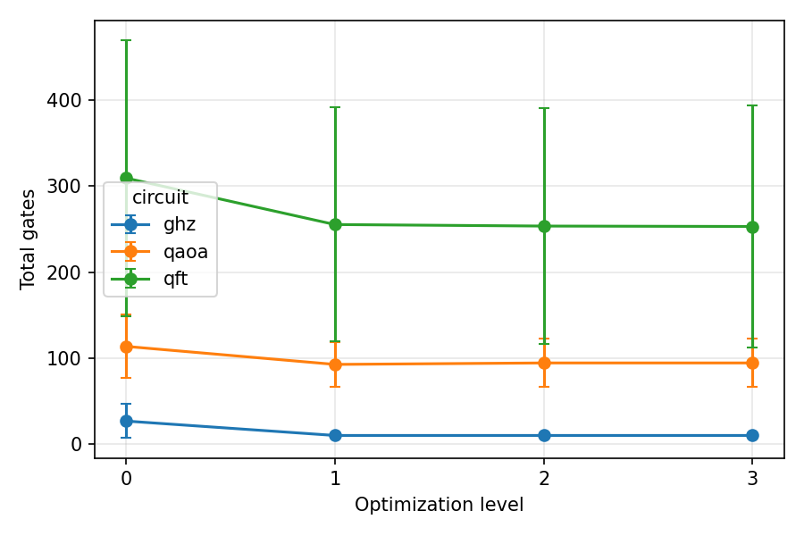
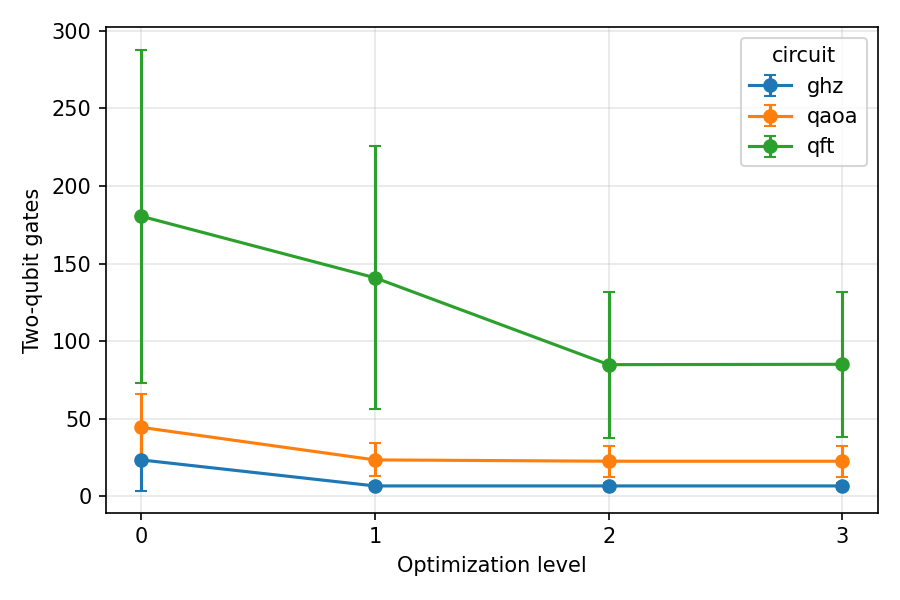
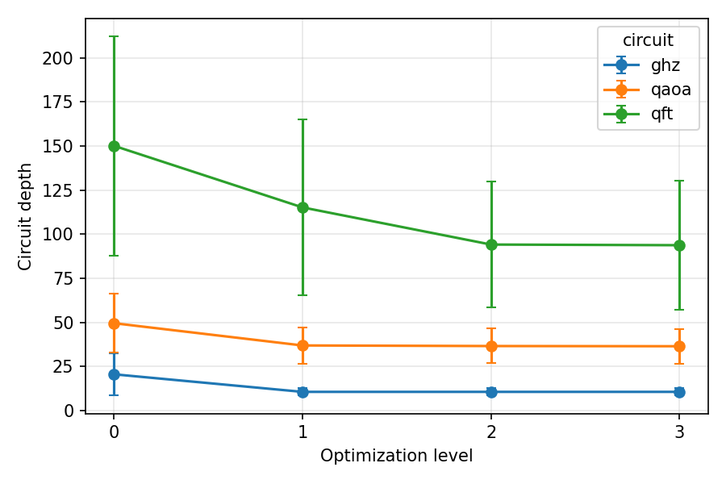
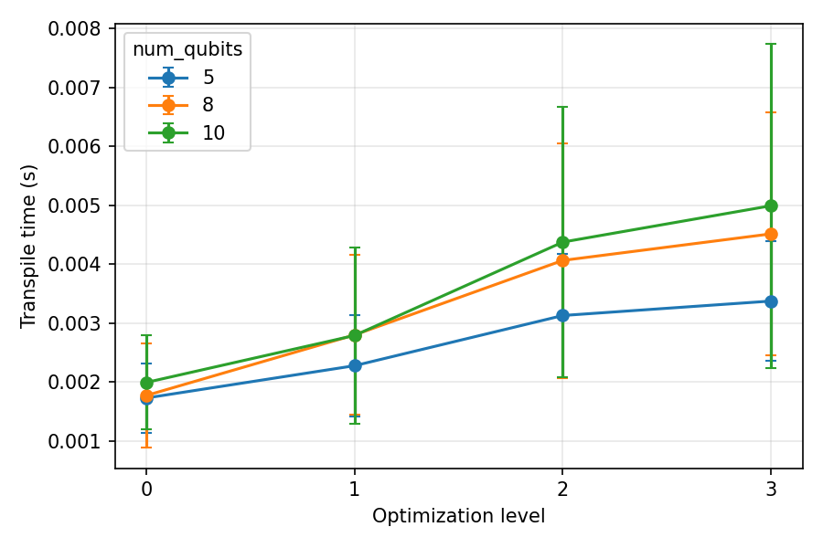
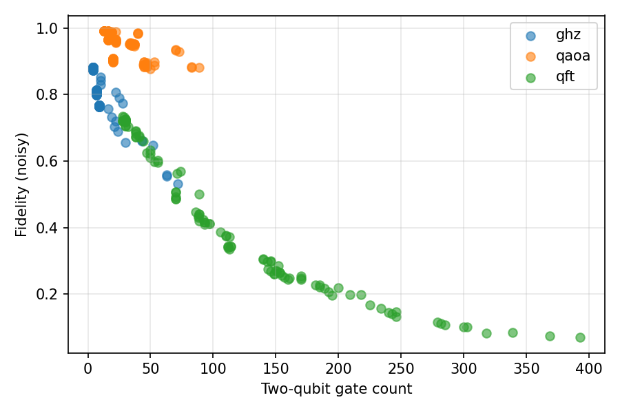
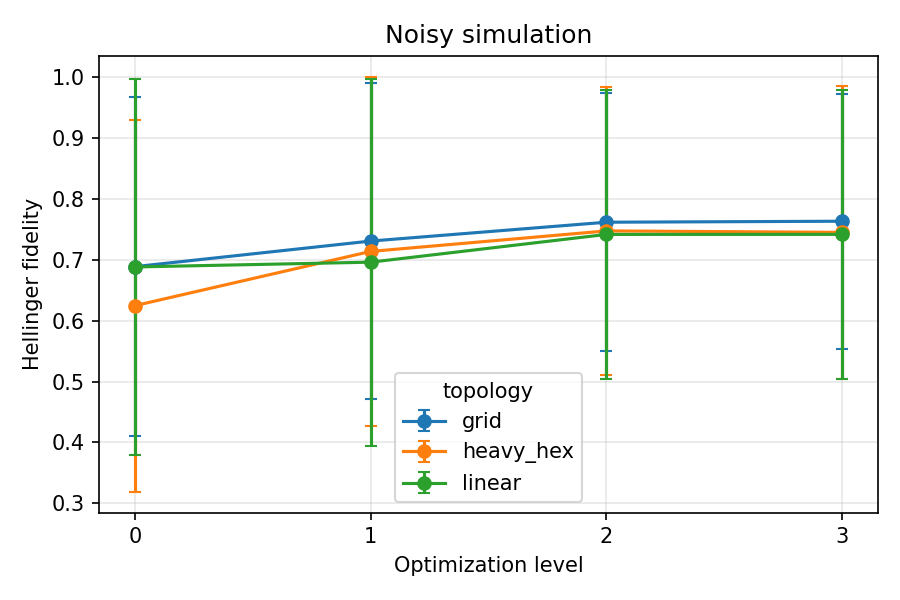
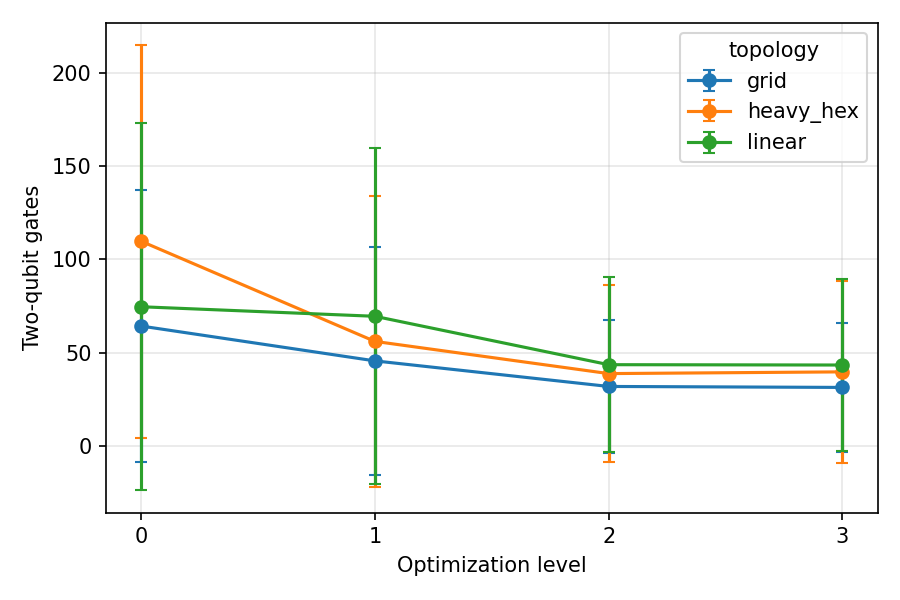
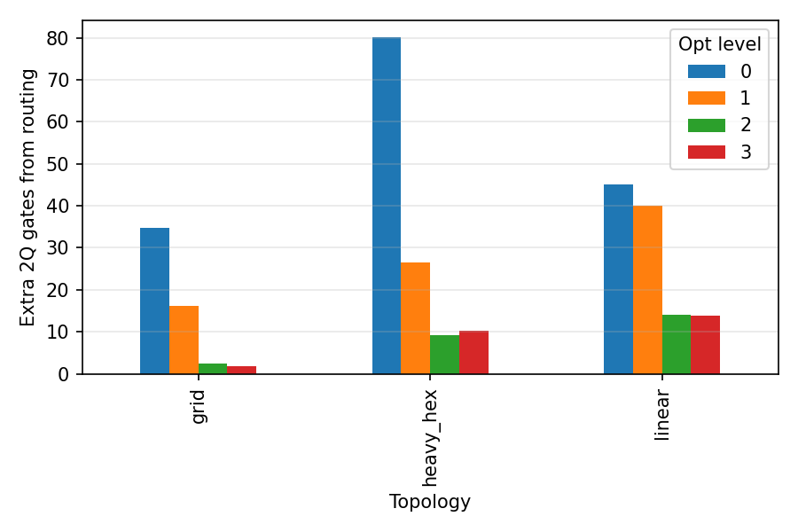
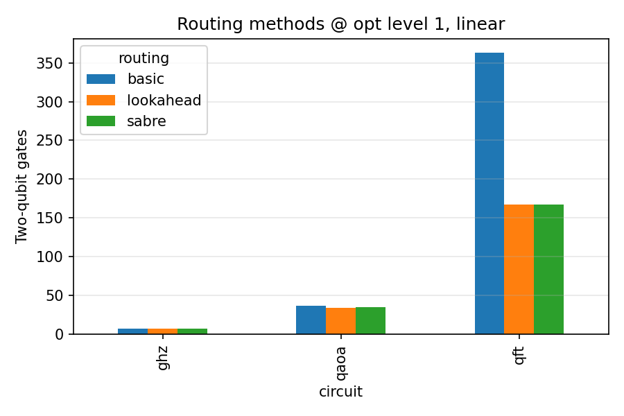

# Quantum Circuit Optimization — Preliminary Study

A scaled-down preliminary study of quantum circuit transpilation, inspired by **Safi et al. (2025)** *"Stacking the odds: full-stack quantum system design space exploration"* ([EPJ Quantum Technology, 12, 117](https://doi.org/10.1140/epjqt/s40507-025-00413-7)).

While the original paper performs a comprehensive full-stack design space exploration across up to 128 qubits, 30 benchmark circuits, multiple noise models (including crosstalk), and extensive compilation configurations, **this study deliberately reduces the scale** to isolate and verify core findings on a smaller, more tractable setup — serving as a foundation for further investigation.

## Motivation

Safi et al. demonstrate that quantum circuit performance depends on the interplay between compilation strategies (routing, layout, optimisation level) and hardware characteristics (topology, connectivity, noise). Their key conclusions include:

1. **Connectivity density** is the dominant factor for both fidelity and circuit depth.
2. **SABRE routing** consistently outperforms alternatives.
3. **Optimisation level 1** provides the best cost-performance trade-off (diminishing returns beyond).
4. **Back-end size scaling** offers limited benefit — topology structure matters more than qubit count.
5. Circuit performance is **highly benchmark-specific**.

This preliminary study asks: **do these findings hold at a smaller scale with a simpler noise model?**

## Experimental Settings

### Circuits

| Circuit | Description | Connectivity Pattern |
|---------|-------------|---------------------|
| **GHZ** | Greenberger–Horne–Zeilinger state preparation | Linear chain (nearest-neighbour CX) |
| **QFT** | Quantum Fourier Transform on uniform superposition | All-to-all (long-range interactions) |
| **QAOA** | QAOA p=1 for MaxCut on a ring graph (fixed γ=0.8, β=0.4) | Ring (nearest-neighbour RZZ) |

### Parameter Space

| Parameter | Values |
|-----------|--------|
| Num. qubits | 5, 8, 10 |
| Optimisation level | 0, 1, 2, 3 |
| Topology | `linear`, `grid` (2×⌈n/2⌉), `heavy_hex` (distance-3, 19 qubits) |
| Noise model | Depolarising (1Q: 10⁻³, 2Q: 10⁻²) + Readout error (2%) |
| Shots | 4 096 per experiment |
| Seeds | 3 transpiler seeds (11, 22, 33) |
| Simulation | ideal (no noise) and noisy (Qiskit Aer) |

**Side-study:** Routing method comparison (SABRE, Basic, Lookahead) at optimisation level 1 on linear topology.

### Metrics

- **Hellinger fidelity** — measured between statevector reference distribution and sampled counts
- **Success probability** — fraction of shots yielding a correct bitstring
- **Gate profile** — total gates, 1Q gates, 2Q gates after transpilation
- **Circuit depth** after transpilation
- **Routing overhead** — additional 2Q gates introduced by SWAP insertion
- **Transpile time**

### Comparison with Safi et al.

| Dimension | Safi et al. | This study |
|-----------|-------------|------------|
| Scale | up to 128 qubits, 30 circuits | ≤ 10 qubits, 3 circuits |
| Noise models | Crosstalk (3 models) + thermal relaxation + depolarising | Depolarising + readout only |
| Layout methods | Trivial, Dense, SABRE | Preset default |
| Routing methods | SABRE, Stochastic | SABRE, Basic, Lookahead |
| Fidelity | Analytical estimate | Simulated (Aer) |
| Topology | Heavy-hex, Sycamore (grid) | Linear, grid, heavy_hex |

## Key Results

### 1. Optimisation Level Reduces Gate Count with Diminishing Returns

| Opt Level | 2Q Gates (mean) | Depth (mean) | Fidelity (noisy, mean) |
|-----------|-----------------|-------------|----------------------|
| 0 | 82.8 | 73.5 | 0.667 |
| 1 | 57.0 | 54.3 | 0.714 |
| 2 | 38.0 | 47.1 | 0.750 |
| 3 | 38.1 | 47.0 | 0.750 |

- **54% reduction** in 2Q gates from level 0 → 3.
- **Level 2 is the sweet spot** — level 3 provides negligible additional benefit.
- Consistent with Safi et al.'s finding of diminishing returns, though they identify level 1 as sufficient (likely due to larger circuit scale where peephole optimisation in L2 has less impact).

<p align="center">
  
  
</p>
<p align="center">
  
  
</p>

### 2. 2-Qubit Gate Count is the Strongest Predictor of Fidelity

- **Pearson r = −0.874** between 2Q gate count and Hellinger fidelity (noisy simulation).
- At p₂ = 1% per CX: circuits with > 100 CX gates have fidelity < 0.5.
- Supports Safi et al.'s cost improvement metric design, which weights 2Q gate fidelity heavily (F₂q = 0.9765 vs F₁q = 0.9982).

<p align="center">
  
</p>

### 3. Circuit Type Dominates Over Optimisation Level

| Circuit | Fidelity (noisy) | 5q | 8q | 10q |
|---------|:-:|:-:|:-:|:-:|
| QAOA | **0.947** ± 0.039 | 0.989 | 0.956 | 0.896 |
| GHZ | **0.799** ± 0.071 | 0.869 | 0.788 | 0.741 |
| QFT | **0.414** ± 0.212 | 0.675 | 0.359 | 0.209 |

- Shallow circuits (QAOA p=1) are noise-resilient; deep all-to-all circuits (QFT) degrade rapidly.
- QFT at 10 qubits produces near-random output (fidelity ~0.21).
- Consistent with Safi et al.'s observation that results are "highly benchmark-specific."

<p align="center">
  
</p>

### 4. Topology with Higher Connectivity Reduces Routing Overhead

| Topology | Routing Overhead (extra 2Q gates) | Fidelity (noisy) |
|----------|----------------------------------|-------------------|
| Grid | **13.8** | **0.736** |
| Linear | 28.3 | 0.717 |
| Heavy_hex | 31.6 | 0.708 |

- Grid (degree ≤ 4) outperforms linear (degree 2) and heavy_hex (degree ≤ 3) in routing efficiency.
- Aligns with Safi et al.'s key conclusion that **connectivity density is the dominant factor**.
- Note: Safi et al. additionally found that heavy_hex has better **crosstalk resilience** despite lower connectivity — a trade-off not captured by our depolarising-only noise model.

<p align="center">
  
  
</p>

### 5. SABRE Routing Outperforms Alternatives

| Routing | 2Q Gates (mean) | Fidelity (mean) | Depth (mean) |
|---------|:-:|:-:|:-:|
| SABRE | **69.4** | 0.696 | **58.9** |
| Lookahead | 69.2 | **0.697** | 60.7 |
| Basic | 135.5 | 0.653 | 90.3 |

- SABRE ≈ Lookahead >> Basic, with Basic producing ~2× the 2Q gates.
- Difference is stark for QFT (Basic: 363 vs SABRE: 167 2Q gates) but negligible for GHZ.
- Consistent with Safi et al.: *"SABRE router consistently outperforms the Stochastic approach, especially for large and structurally complex circuits."*

<p align="center">
  
</p>

## Key Challenges in Quantum Circuit Optimisation

This preliminary study, combined with insights from Safi et al., highlights the following **fundamental challenges** in the field:

### 1. The NISQ Fidelity Wall
Even with the best transpiler settings, noisy simulation fidelity averages only **0.75** (vs 0.99 ideal). For circuits like QFT at ≥ 10 qubits, output is essentially random. Transpiler optimisation is **necessary but not sufficient** — error mitigation and eventually error correction are required.

### 2. The Routing Problem is Circuit-Dependent
No single routing strategy is universally optimal. Circuits with local connectivity (GHZ, QAOA) are trivial to route; circuits requiring all-to-all interaction (QFT) suffer massive routing overhead. This suggests that **circuit-aware compilation** — where the transpiler adapts its strategy to the circuit's interaction graph — is crucial.

### 3. The Topology–Noise Trade-off
Higher connectivity reduces routing overhead but may amplify crosstalk (as shown by Safi et al.'s shared qubit model). This creates an inherent tension: **the hardware topology that minimises gate count may not minimise total error**. Resolving this requires hardware-software co-design that considers both routing and noise simultaneously.

### 4. Diminishing Returns of Classical Optimisation
Both studies find diminishing returns at higher optimisation levels. Beyond a "good enough" configuration (L1–L2 with SABRE), further classical optimisation effort yields marginal gains. This points to a **fundamental limit** of classical compilation techniques — motivating research into quantum-aware compilation (e.g., noise-adaptive mapping, dynamic decoupling-aware scheduling).

### 5. Scalability Uncertainty
Our results at 5–10 qubits may not extrapolate to 100+ qubits. Safi et al.'s larger-scale study suggests some findings shift (e.g., the optimal opt level). **Cross-scale validation** remains an open challenge — small-scale studies are tractable but may not capture phenomena that emerge at scale.

## Project Structure

```
qcopt-preliminary-study/
├── src/
│   ├── circuits.py        # GHZ, QFT, QAOA circuit builders
│   ├── experiment.py      # Main sweep + routing side-study
│   ├── metrics.py         # Fidelity, success probability, gate profile
│   ├── noise_models.py    # Depolarising + readout noise model
│   ├── topologies.py      # Linear, grid, heavy_hex coupling maps
│   └── plots.py           # Result visualisation
├── results/
│   ├── raw_results.csv    # Full experiment data (648 rows)
│   ├── routing_study.csv  # Routing method comparison (81 rows)
│   └── figures/           # Generated plots
└── requirements.txt
```

## Reproducing

```bash
pip install -r requirements.txt
cd src
python experiment.py      # ~5–10 min, outputs to results/
python plots.py           # generates figures
```

## Reference

```bibtex
@article{safi2025stacking,
  title     = {Stacking the odds: full-stack quantum system design space exploration},
  author    = {Safi, Hila and Bandic, Medina and Niedermeier, Christoph
               and Almudever, Carmen G. and Feld, Sebastian and Mauerer, Wolfgang},
  journal   = {EPJ Quantum Technology},
  volume    = {12},
  number    = {117},
  year      = {2025},
  doi       = {10.1140/epjqt/s40507-025-00413-7}
}
```
